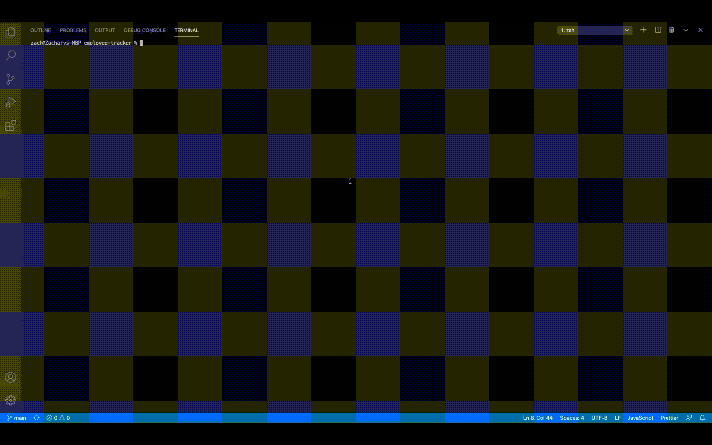

# Employee Tracker

## Table of Contents
* [Description](#description)
* [User Story](#user-story)
* [Installation](#installation)
* [Contributors](#contributors)
* [Demo](#demo)
* [Questions & Contact Information](#questions)

## Description

The task was to create an interface that would make it easy for non-developers to view and interact with information stored in the databases.

## User Story

As a business owner  
I want to be able to view and manage the departments, roles, and employees in my company  
So that I can organize and plan my business  

## Installation

- Installation should include downloading or cloning the repository from Github.
- Then run an "npm init -y" and "npm install" to install all dependencies.
- Dependencies should include the following:
    - CFonts: 2.9.1
    - Chalk: 4.1.0
    - Console Table Printer: 2.7.5
    - Inquirer: 8.0.0
    - Mysql: 2.18.1

## Contributors

- UNC Chapel Hill Full-Stack Coding Bootcamp

## Demo

- Demo of the application in action.

## Questions

If you have any questions please contact me via Github or Email below  
        Github Profile: [zsmith4331](https://github.com/zsmith4331) | Email: zsmith4331@gmail.com
    